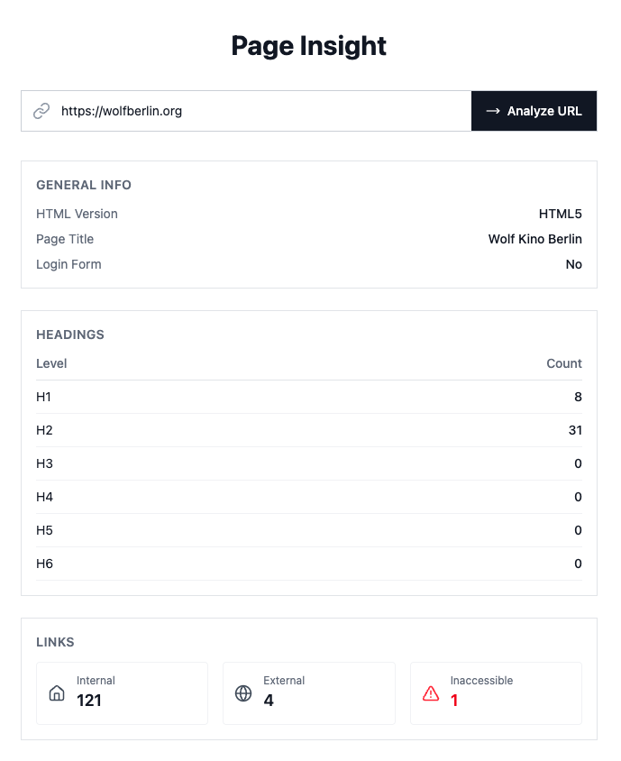

# Page Insight Tool

A web application that accepts a URL, analyzes the page's HTML content, and displays insights such as HTML version, heading counts, link statistics, and login form detection.

## Prerequisites

- Go >= 1.25
- Node.js >= 18

## Build & Run

### Backend

```bash
cd backend
make run
```

The API server starts on `http://localhost:8080` by default.

### Frontend

```bash
cd frontend
npm install
npm run dev
```

The dev server starts on `http://localhost:3000` by default.



## Assumptions and design decisions made

- Pages behind WAF or bot protection will likely reject the request; the tool works on publicly accessible
  pages.
- The backend uses a hexagonal architecture: domain logic in pageinsight has no HTTP awareness, and the analyzer
  package adapts it to HTTP via an interface.
- Dependencies are kept minimal (only google/uuid and golang.org/x/net).
- A link is "inaccessible" if it returns a 4xx or 5xx status code, and "internal" if it shares the same host as the
  input URL.
- A page contains a login form if it has a password input field.
- Link checking uses a bounded worker pool (default 25 workers, max 1000 links) with HEAD requests first and a GET
  fallback when servers reject HEAD with 403/405.
- SSRF protection blocks private IPs, loopback, cloud metadata endpoints, and IPv4-in-IPv6 bypass attempts.
- Resource limits are enforced at multiple layers: 10 MB response body, 1 MB request body, 5 max redirects, and
  per-request timeouts.

## Suggestions for future improvements

- Support JavaScript-rendered SPAs by integrating third-party pkgs with a headless browser as a fallback when the static
  HTML lacks expected content.
- Add response caching (e.g. Redis or in-memory with TTL) to avoid re-fetching recently analyzed URLs.
- Add Prometheus metrics for request counts, latency distributions, and link-check error rates.
- Restrict CORS to known frontend origins instead of the current wildcard (*).
- Add Metrics/observability.
- Increase test coverage, add integration tests, and use a test framework like testify for better assertions and test organization.
